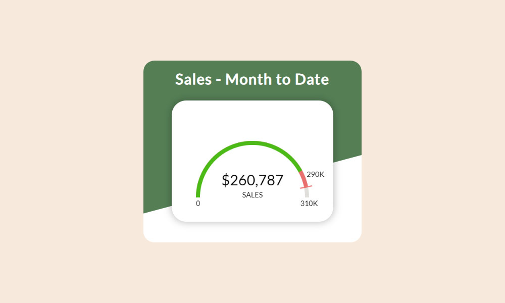

# KPI Meter Component by Jeff Lang

This is a web component modeled after a component I've seen in the Netsuite ERM system. 

Time to complete: 10 hrs 15 min

## Table of contents

- [Overview](#overview)
  - [The challenge](#the-challenge)
  - [Screenshot](#screenshot)
  - [Links](#links)
- [My process](#my-process)
  - [Built with](#built-with)
  - [How I started](#how-i-started)
  - [What I learned](#what-i-learned)
  - [Continued development](#continued-development)
  - [Useful resources](#useful-resources)
- [Author](#author)

## Overview

### The challenge

Users should be able to:

- Load data via JSON file
- View current sales figures compared to forecast

### Screenshot



### Links

- Live Site URL: [jefflangtech.github.io/kpi-meter/](https://jefflangtech.github.io/kpi-meter/)

## My process

### Built with

- Semantic HTML5 markup
- Javascript and drawing on the canvas element
- [Node.js](https://nodejs.org/en/)
- [Express](http://expressjs.com/)

### How I Started

This was supposed to be a project during which I could learn about and get some experience with chartJS. However, I had already settled on modeling something like the Netsuite component, and chartJS (to my knowledge) didn't have a chart option that would appear the same. Instead this became a project about drawing a custom chart on the canvas.

### What I learned

Drawing on the canvas has some definite quirks. I learned:
- How to draw on the canvas
- How to track mouseevents within the canvas element (I didn't include a feature within the component to utilize this, but the is some commented-out JS code that will display the mouse coordinates when moving around within the canvas element)
- How to load a font into the document so that it can be used to draw on the canvas

This was my most fun, back-to-highschool-algebra days, code snippet to figure out - it positions a figure around the outer edge of the arc, and uses the result of a cubic function to slightly tweak the x-position so that (hopefully) the text never overlaps the arc at the extremes.

```js
    // Draw current forecast $ above the chart
    ctx.save()
    ctx.translate(width / 2, height * 0.8)
    let x = 0 - parseInt((height / 2) * Math.cos(Math.PI*currentRadOfDay))
    let y = 0 - parseInt((height / 2) * Math.sin(Math.PI*currentRadOfDay)) - (height * 0.07)
    // Adjust the x position based on current rotation so it does not
    // overlap the chart
    let xAdjust = 15 * (8 * (currentRadOfDay - 0.5) ** 3)
    x = x + xAdjust
    ctx.font = `${height * 0.06}px myFont`
    ctx.fillStyle = 'black'
    ctx.textAlign = 'center'
    let salesForecast = currentDayOfMonth * DAILYSALES
    if(salesForecast / 1000 > 1) {
      salesForecast = Math.floor(salesForecast / 1000)
      ctx.fillText(`${salesForecast}K`, x, y)
    } else {
      ctx.fillText(`${salesForecast}`, x, y)
    }
    ctx.restore()
```

### Continued development

- The javascript code is written so that it will adjust in size to a given canvas size (very basic testing). However, the page itself is not responsive so that might be something I work on later.
- Since I skipped this time around I will need to work on another project using chartJS so I can see what that's all about.

### Useful resources

- [JSON Generator](https://json-generator.com/) - I only barely scratched the surface of this site but it seems very useful for generating seed data for projects.
- [MDN of course!](https://developer.mozilla.org/en-US/docs/Web/API/Canvas_API/Tutorial) - I went through the first few pages of the MDN canvas tutorial and then I felt like I had enough information to get myself into trouble.

## Author

- LinkedIn - [Jeff Lang](https://www.linkedin.com/in/jeff-lang-a28b4288/)
- Website - [Jeff Lang](https://jefflangtech.github.io/)
- Frontend Mentor - [@jefflangtech](https://www.frontendmentor.io/profile/jefflangtech)
- Twitter - [@jefflangtech](https://twitter.com/jefflangtech)
